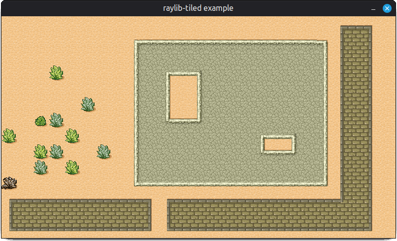

# raylib-tiled

[Tiled](https://www.mapeditor.org/) map editor integration for [raylib](https://www.raylib.com/), using [cute_tiled](https://github.com/RandyGaul/cute_headers/blob/master/cute_tiled.h).



## Usage

```c
#include "raylib.h"

#define RAYLIB_TILED_IMPLEMENTATION
#include "raylib-tiled.h"

int main() {
    InitWindow(800, 450, "raylib-tiled");

    // Load the map
    Map map = LoadMap("resources/desert.json");

    while (!WindowShouldClose()) {
        BeginDrawing();
        ClearBackground(RAYWHITE);

        // Draw the map
        DrawMap(map, 0, 0, WHITE);

        EndDrawing();
    }

    // Unload the map
    UnloadMap(map);
    CloseWindow();
    return 0;
}
```

## API
```c
Map LoadMap(const char* fileName);
Map LoadMapFromMemory(const unsigned char *fileData, int dataSize, const char* baseDir);
bool IsMapReady(Map map);
void UnloadMap(Map map);
void DrawMap(Map map, int posX, int posY, Color tint);
```

## Development

```bash
mkdir build
cd build
cmake ..
make
cd example
./raylib-tiled-example
```

## Alternatives

- [raylib-tileson](https://github.com/robloach/raylib-tileson)
- [raylib-tmx](https://github.com/RobLoach/raylib-tmx)

## License

*raylib-tiled* is licensed under an unmodified zlib/libpng license, which is an OSI-certified, BSD-like license that allows static linking with closed source software. Check [LICENSE](LICENSE) for further details.
